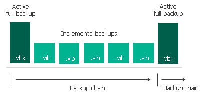

# Active Full Backup

In some cases, you need to regularly create a full backup. For example, your corporate backup policy may require that you create a full backup on weekend and run incremental backup on work days. To let you conform to these requirements, Veeam Backup & Replication allows you to create active full backups (either manually or automatically according to a specific schedule).

When creating an active full backup, Veeam Backup & Replication starts a new backup chain for the VM. All further created incremental backups use the latest active full backup file as a new starting point. The old full backup file from the old backup chain remains on disk until it is automatically deleted according to the retention policy.

The active full backup session starts at the same time when the backup job is scheduled. For example, if you schedule the backup job to run at 12:00 AM Sunday through Friday, and schedule active full backup to be created on Saturday, Veeam Backup & Replication will start a backup job session that will produce an active full backup at 12:00 AM on Saturday.

If the backup job is not scheduled to run automatically or is disabled,Veeam Backup & Replication will not perform active full backup. If a regular backup session and an active full backup session are scheduled on the same day, Veeam Backup & Replication will produce an active full backup — an incremental backup that should have been created by the regular backup session will not be added to the backup chain. However, if you run the backup job again on the same day manually, Veeam Backup & Replication will perform incremental backup in a regular manner.

Related Topics

* [Creating Active Full Backups](crearting_active_full_backup.md)
* [Creating Backup Jobs](backup_job_create.md)

