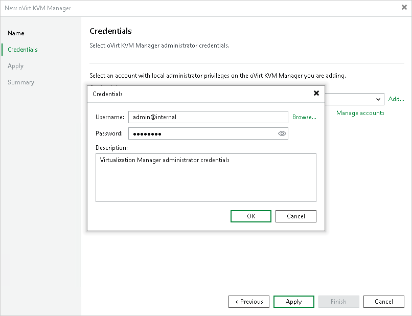

# Step 3. Enter Credentials

At the Credentials step of the wizard, specify credentials for an administrator account with the SuperUser role that is used to access the oVirt KVM Manager. For more information on oVirt system administrator roles, see [Red Hat Virtualization documentation](https://access.redhat.com/documentation/en-us/red_hat_virtualization/4.4/html/administration_guide/part-administering_and_maintaining_the_red_hat_virtualization_environment#Administrator_Roles_Explained) or [Oracle Linux Virtualization Manager documentation](https://docs.oracle.com/en/virtualization/oracle-linux-virtualization-manager/admin/admin-admin-global-config.html#admin-portal-user-management).

For credentials to be displayed in the Credentials list, they must be added to the Credentials Manager as described in the Veeam Backup & Replication User Guide, section [Standard Accounts](https://helpcenter.veeam.com/docs/vbr/userguide/credentials_manager_windows.html?ver=13). If you have not added the necessary credentials to the Credentials Manager beforehand, you can do this without closing the New oVirt KVM Manager wizard. To add an account, do the following:

1. Click Add.
2. In the Credentials window, do the following:

1. In the Username field, enter the name of a user account with administrative privileges and the name of the user domain in the following format:

For more information on oVirt user domains, see [Red Hat Product Documentation](https://access.redhat.com/documentation/en-us/red_hat_virtualization/4.4/html/administration_guide/chap-users_and_roles) or [Oracle Linux Virtualization Manager documentation](https://docs.oracle.com/en/virtualization/oracle-linux-virtualization-manager/admin/admin-admin-portal-user-management.html#admin-portal-user-management).

1. In the Password field, enter the password for the account.

1. Click OK.

The backup server will connect to the oVirt KVM Manager and check its TLS certificate. If the certificate is not trusted on the backup server, the Certificate Security Alert Window will display a warning notifying that secure communication cannot be guaranteed. To allow the backup server to connect to the oVirt KVM Manager using the certificate, click Continue.

