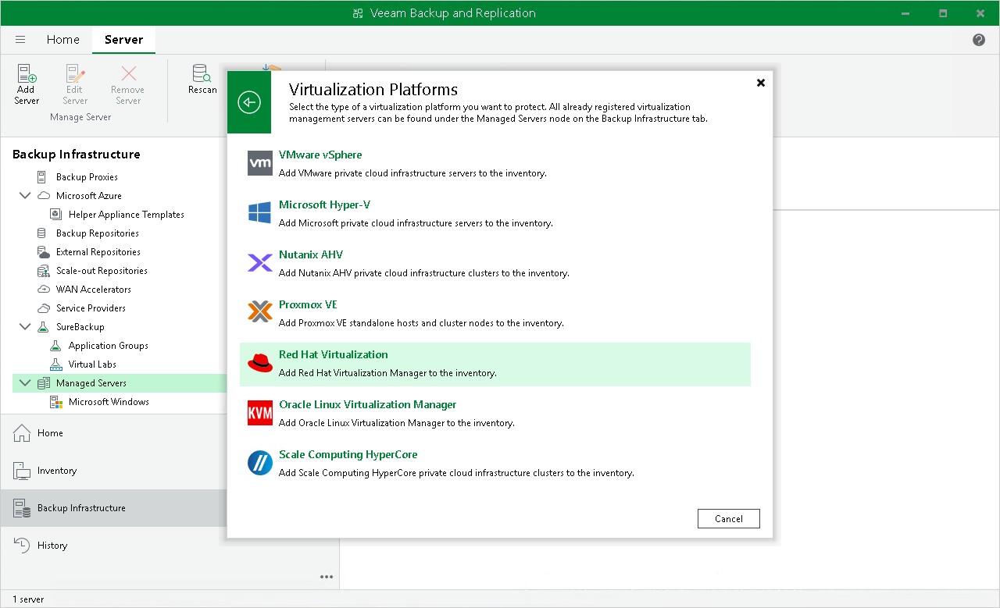

# Step 1. Launch New oVirt KVM Manager Wizard

To launch the New oVirt KVM Manager wizard, do the following:

1. In the Veeam Backup & Replication console, open the Backup Infrastructure view.
2. In the inventory pane, select Managed Servers.
3. On the ribbon, click Add Server.

Alternatively, right-click the working area and select Add Server.

1. In the Add Server window, select Virtualization Platforms.
2. In the Virtualization Platforms window, select Red Hat Virtualization or Oracle Linux Virtualization Manager to launch the New oVirt KVM Manager wizard.

