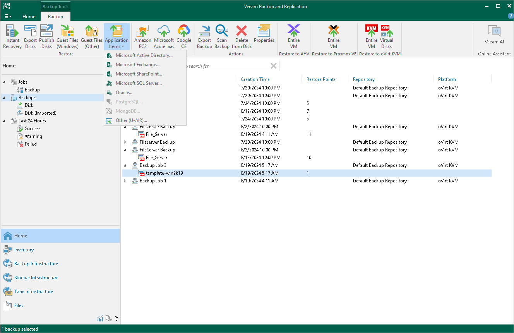

# Performing Application Item Restore

With application item restore, you can use Veeam Plug-in for OLVM and RHV backups to restore the following data:

* Microsoft Active Directory objects and containers
* Microsoft Exchange mailboxes, folders and messages
* Microsoft SharePoint sites and lists
* Microsoft SQL Server
* Oracle databases

To restore application items from a Veeam Plug-in for OLVM and RHV VM backup, do the following:

1. In the Veeam Backup & Replication console, open the Home view.
2. In the inventory pane, select Backups.
3. In the working area, expand the necessary backup job, select the VM that contains an application you want to restore.
4. Click Application Items on the ribbon and the select the application.
5. In the restore wizard, select a restore point that will be used to restore the application, specify a restore reason and click Browse.
6. In the Veeam Explorer application, perform the steps described in the [Veeam Explorers User Guide](https://helpcenter.veeam.com/docs/backup/explorers/explorers_introduction.html?ver=120).

|  |
| --- |
| Tip |
| As an alternative to application item restore, you can also [perform file-level restore](vm_guest_restore.md) to recover standalone databases using Veeam Explorers. |

