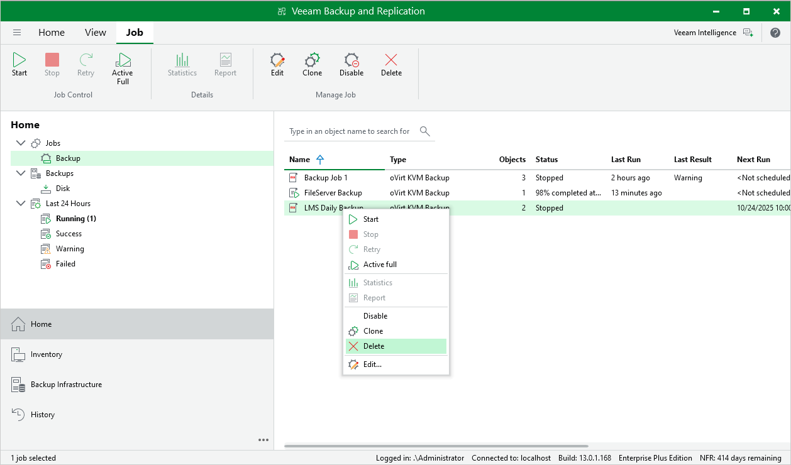

# Deleting Backup Jobs

You can permanently delete a backup job from the Veeam Plug-in for OLVM and RHV configuration database if you no longer need it. When you delete a job, backups created by this job are displayed under the Backups > Disk (Orphaned) node in the Home view of the Veeam Backup & Replication console. If you want to delete backup files as well, follow the instructions provided in section [Deleting Backups](retention.md).

To delete a backup job, do the following:

1. Open the Home view.
2. In the inventory pane, select Jobs.
3. In the working area, select the job and click Delete on the ribbon.

Alternatively, right-click the job and select Delete.

