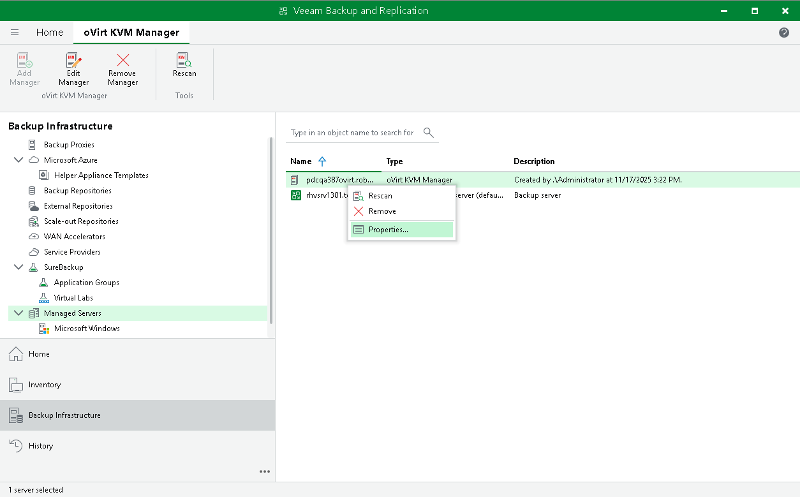

# Editing oVirt KVM Manager Properties

To edit properties of the oVirt KVM Manager added to the backup infrastructure, do the following:

1. Open the Backup Infrastructure view.
2. In the inventory pane, select Managed Servers > oVirt KVM.
3. In the working area, select the oVirt KVM Manager and click Edit Manager on the ribbon.

Alternatively, right-click the oVirt KVM Manager and select Properties.

1. Complete the Edit oVirt KVM Manager wizard as described in section [Adding oVirt KVM Manager to Backup Infrastructure](add_rhv_manager.md).

