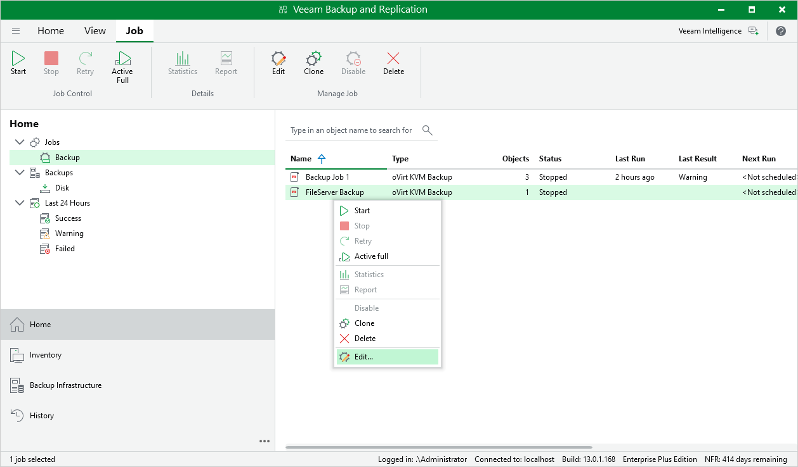

# Editing Backup Job Settings

For each backup job, you can modify settings configured while creating the job.

1. Open the Home view.
2. In the inventory pane, select Jobs.
3. In the working area, select the job and click Edit on the ribbon.

Alternatively, right-click the job and select Edit.

1. Complete the Edit Job wizard:

1. To provide a new name and description for the job, follow the instructions provided in section [Creating Backup Jobs](backup_job_general_settings.md) (step 2).
2. To edit the backup scope, follow the instructions provided in section [Creating Backup Jobs](backup_job_assign_vms.md) (step 3).
3. To change the backup repository where backups are stored, to configure backup job retention settings, to schedule active and synthetic full backups, and to configure health checks, follow the instructions provided in section [Creating Backup Jobs](backup_job_destination.md) (step 4).
4. To modify the job schedule and configure automatic retry settings, follow the instructions provided in section [Creating Backup Jobs](backup_job_schedule.md) (step 5).
5. At the Summary step of the wizard, review configuration information and click Finish.

