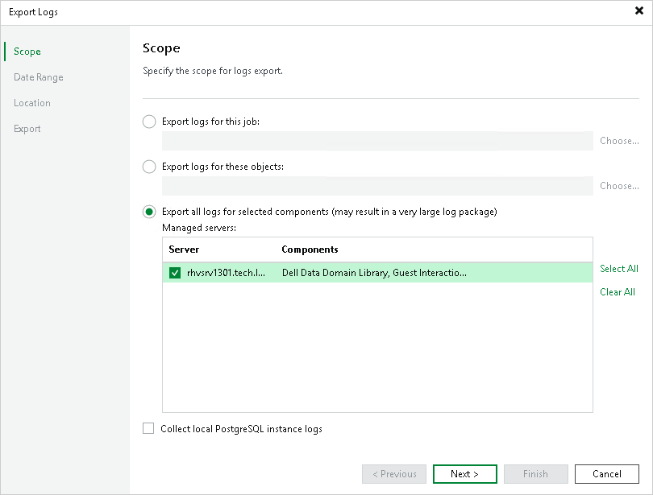

# Getting Technical Support

If you have any questions or issues with Veeam Plug-in for OLVM and RHV, you can search for a resolution on [Veeam R&D Forums](https://forums.veeam.com/) or submit a support case in the [Veeam Customer Support Portal](https://www.veeam.com/support.html).

When you submit a support case, it is recommended that you provide the Veeam Customer Support Team with the following information:

* [Version information for the product and its infrastructure components](#ViewingProductDetails)
* The error message or an accurate description of the problem you are facing
* [Log files](#DownloadingLogs)

Viewing Product Details

* On the server running the Veeam Backup & Replication console, navigate to Settings > Apps & features.

Alternatively, open the Control Panel window and navigate to Programs > Programs and Features.

* In the program list, check the version of Veeam Plug-in for Oracle Linux Virtualization Manager and Red Hat Virtualization.

Downloading Logs

To download the product logs, do the following:

1. From the main menu of the Veeam Backup & Replication console, select Help > Support Information.
2. At the Scope step of the Export Logs wizard, select the Export all logs for selected components option. Then, in the Managed servers list, select the backup server and the VM running as the backup appliance.

Complete the wizard as described in the Veeam Backup & Replication User Guide, section [Exporting Logs](https://helpcenter.veeam.com/docs/backup/vsphere/exporting_logs.html?ver=120).

