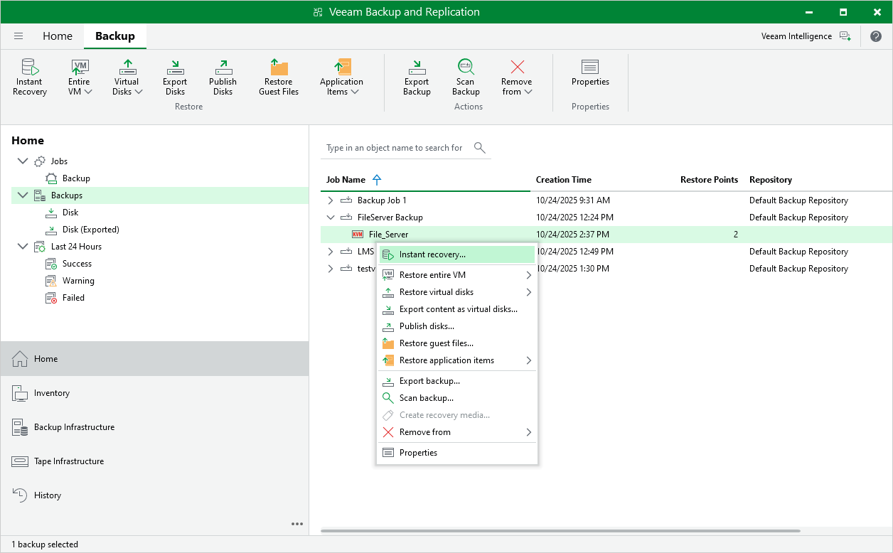

# Performing Instant VM Recovery

With Instant VM Recovery, you can immediately restore oVirt VMs as VMware vSphere, Microsoft Hyper-V or Nutanix AHV VMs to your production environment by running them directly from their backups. Instant VM Recovery helps you improve recovery time objectives and minimize disruption and downtime of production workloads. For more information on Instant VM Recovery, see the Veeam Backup & Replication User Guide, section [VM Recovery](https://tw-preview.dev.amust.local/html/vbr/13.0.1/userguide/vm_restores.html?ver=13).

To perform Instant VM Recovery, do the following:

1. In the Veeam Backup & Replication console, open the Home view.
2. In the inventory pane, select Backups.
3. In the working area, right-click the VM you want to restore, and select Instant Recovery.

* To restore the VM to VMware vSphere, complete the Instant Recovery wizard as described in the Veeam Backup & Replication User Guide for VMware vSphere, section [Performing Instant VM Recovery of Workloads to VMware vSphere VMs](https://helpcenter.veeam.com/docs/vbr/userguide/instant_recovery.html?ver=13).
* To restore the VM to Microsoft Hyper-V, complete the Instant Recovery wizard as described in the Veeam Backup & Replication User Guide for Microsoft Hyper-V, section [Performing Instant VM Recovery of Workloads to Hyper-V VMs](https://helpcenter.veeam.com/docs/vbr/userguide/instant_recovery_to_hv.html?ver=13).
* To restore the VM to Nutanix AHV, complete the Instant Recovery wizard as described in the Veeam Backup for Nutanix AHV User Guide, section [Performing Instant VM Recovery of Workloads to Nutanix AHV](https://helpcenter.veeam.com/docs/vbr/userguide/instant_recovery_to_nutanix.html?ver=13).

