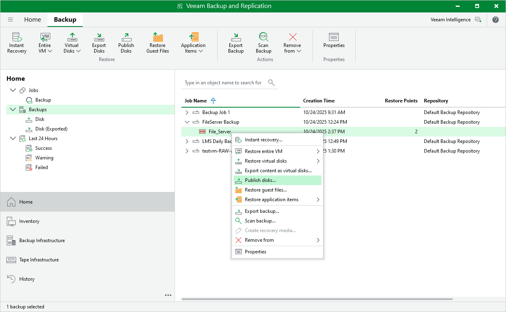

# Publishing Disks

Veeam Backup & Replication allows you to mount specific disks of backed-up oVirt VMs to any server and to instantly access data in the read-only mode. This can be helpful when you want to copy files and folders as of a point-in-time state to the target server, and perform an antivirus scan of the backed-up data. For more information, see the Veeam Backup & Replication User Guide, section [Disk Publishing (Data Integration API)](https://helpcenter.veeam.com/docs/backup/vsphere/data_integration_api.html?ver=120).

To publish disks of an oVirt VM, do the following:

1. In the Veeam Backup & Replication console, open the Home view.
2. In the inventory pane, select Backups.
3. In the working area, expand the necessary backup job, right-click the VM that contains disks you want to mount and select Publish disks.
4. Complete the Publish Disk wizard as described in the Veeam Backup & Replication User Guide, section  [Publishing Disks](https://helpcenter.veeam.com/docs/vbr/userguide/integration_publish.html?ver=13).

