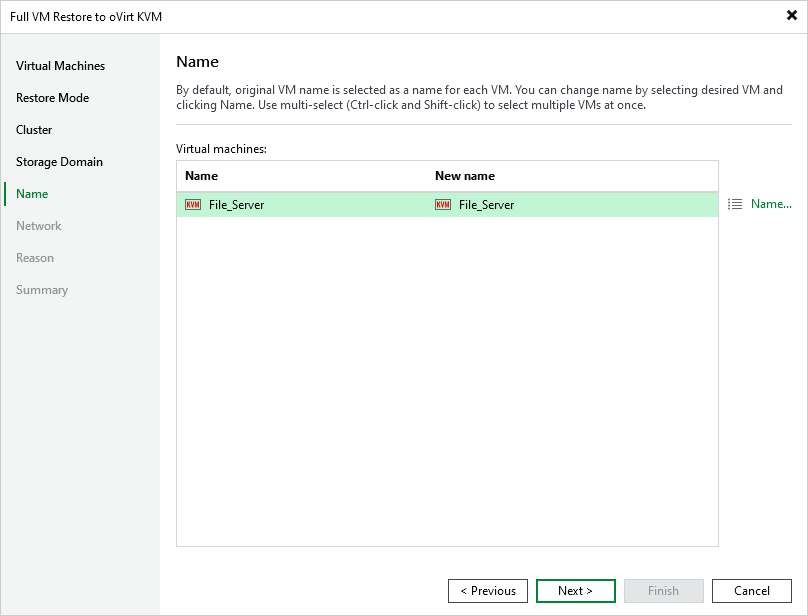

# Step 6. Specify VM Name

[This step applies only if you have selected the Restore to a new location, or with different settings option at the Restore Mode step of the wizard]

At the Name step of the wizard, you can specify a new name for the recovered VM.

