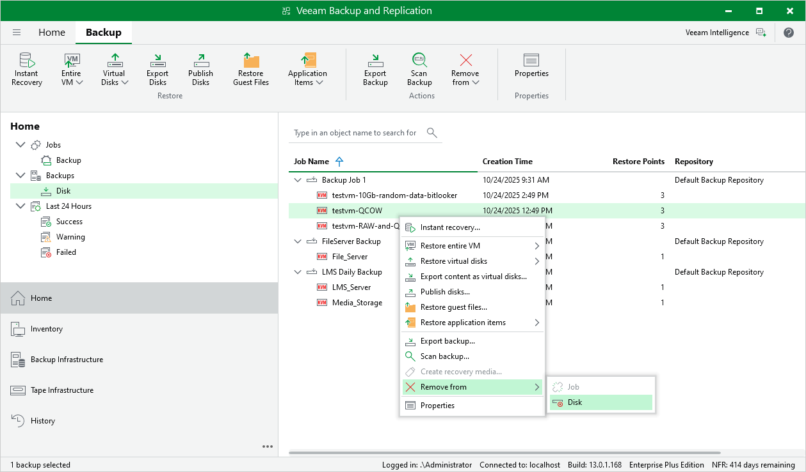

# Deleting Backups

By default, Veeam Plug-in for OLVM and RHV maintains backups stored in backup repositories according to retention policy settings saved in the backup metadata. If Veeam Plug-in for OLVM and RHV detects that the number of restore points in the backup chain exceeds the allowed number, it automatically removes obsolete backups. You can also delete backup files from backup repositories manually if you no longer need them.

To delete backup files created for an oVirt VM, do the following:

1. Open the Home view.
2. In the inventory pane of the Home view, select Backups.
3. In the working area, expand the job that created the backup, right-click the VM name and select Remove from > Disk.

|  |
| --- |
| Note |
| If [4-eyes authorization](https://tw-preview.dev.amust.local/html/vbr/13.0.1/userguide/four_eyes_authorization.html?ver=13) is enabled in Veeam Backup & Replication, deleting backup files will require additional approval from another user with the Veeam Backup Administrator role. |

