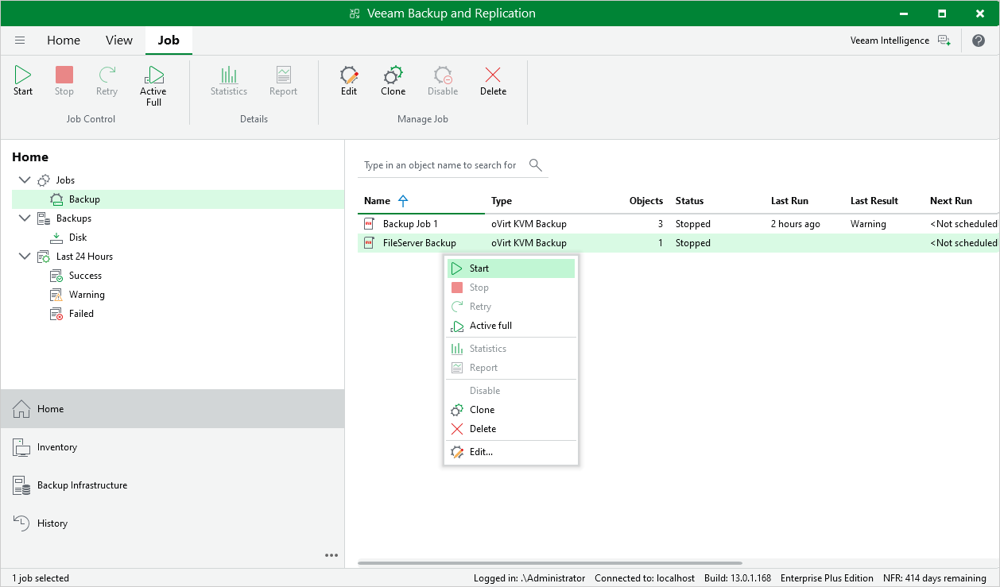

# Starting and Stopping Backup Jobs

You can start a backup job manually, for example, if you want to create an additional restore point and do not want to modify the configured job schedule. You can also stop a backup job manually if processing of an oVirt VM is about to take too long, and you do not want the job to have an impact on the production environment during business hours. When you stop a running job, Veeam Plug-in for OLVM and RHV creates a new restore point only for those VMs that have already been processed by the time you stop the job.

To start or stop a backup job, do the following:

1. Open the Home view.
2. In the inventory pane, select Jobs.
3. In the working area, select the job and click Start or Stop on the ribbon.

Alternatively, right-click the job and select Start or Stop.

