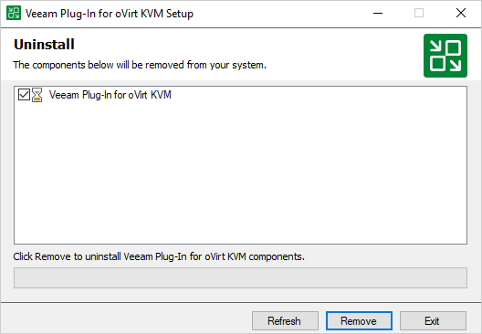

# Uninstalling oVirt Plug-In

To uninstall oVirt KVM Plug-in, do the following:

1. Log in to the backup server using an account with the Local Administrator permissions.
2. Open the Start menu and click the Settings icon.
3. In the Settings window, navigate to System > Apps and Features.
4. In the program list, select Veeam Plug-in for oVirt KVM. Then, click Uninstall.
5. In the opened window, click Remove.

Related Topics

* [Removing oVirt KVM Manager](remove_rhv_manager.md)
* [Removing Workers](workers_remove.md)

