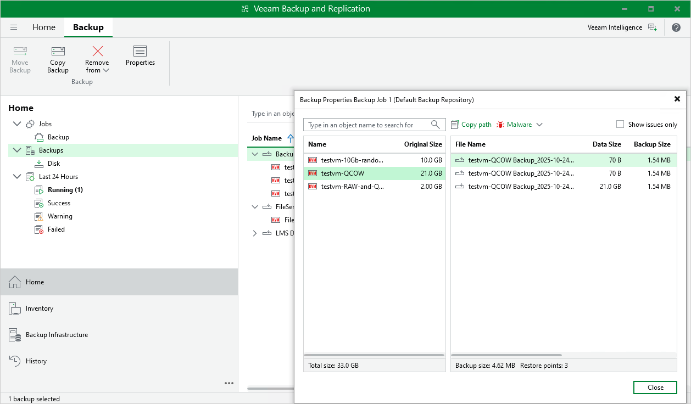

# Viewing Backup Properties

After a backup job successfully creates a backup of an oVirt VM according to the specified schedule, or after you create an active full backup of a VM manually, the backup is displayed under the Backups node in the Home view of the Veeam Backup & Replication console. Each backup and the collection of restore points created for this backup are represented with a set of properties, such as:

* Name — the name of a protected VM.
* Original Size — the total amount of disk space allocated to the VM.
* File Name — the name of a restore point.
* Data Size — the amount of processed VM data.
* Backup Size —  the amount of backed-up VM data.
* Data Reduction — the ratio between the data size and backup size.
* Date — the date and time when the restore point was created.
* Type — the type of backup files inside the backup chain (full or incremental).
* Status — the result of the most recent [malware scan](verify_backups.md) performed for the restore point.

To view backup properties, do the following:

1. Open the Home view.
2. In the inventory pane, select Backups.
3. In the working area, right-click the backup and select Properties.

