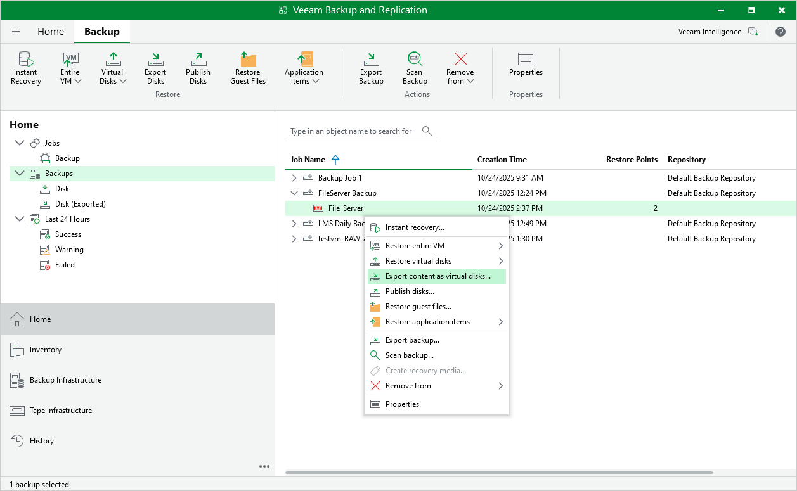

# Exporting Disks

Veeam Plug-in for OLVM and RHV allows you to export disks, that is, restore disks from oVirt VM backups and convert them to the VMDK, VHD and VHDX formats. You can save the exported disks to any server added to the backup infrastructure or place the disks on a datastore connected to an ESXi host (for the VMDK disk format only). For more information, see the Veeam Backup & Replication User Guide, section [Disk Export](https://helpcenter.veeam.com/docs/backup/vsphere/disk_export.html?ver=120).

To export disks of an oVirt VM, do the following:

1. In the Veeam Backup & Replication console, open the Home view.
2. In the inventory pane, select Backups.
3. In the working area, expand the necessary backup job, right-click the VM that contains disks you want to export and select Export content as virtual disks.
4. Complete the Export Disk wizard as described in the Veeam Backup & Replication User Guide, section [Exporting Disks](https://helpcenter.veeam.com/docs/backup/vsphere/exporting_disks.html?ver=120).

