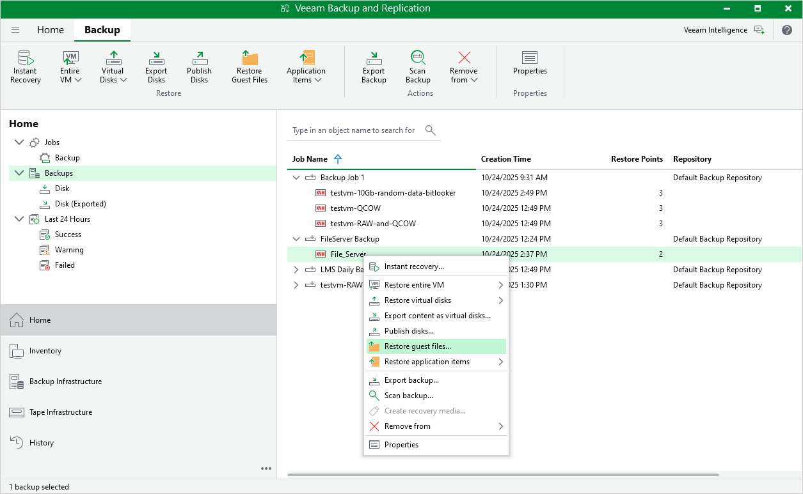

# Performing File-Level Restore

With guest OS file recovery (file-level restore), you can restore individual guest OS files and folders from oVirt VM backups created with Veeam Plug-in for OLVM and RHV. When restoring files and folders, you do not need to extract the VM image to a staging location or start the VM prior to restore. For more information on VM guest OS file restore, see the Veeam Backup & Replication User Guide, section [Guest OS File Recovery](https://helpcenter.veeam.com/docs/vbr/userguide/guest_file_recovery.html?ver=13).

To restore VM guest OS files and folders, do the following:

1. In the Veeam Backup & Replication console, open the Home view.
2. In the inventory pane, select Backups.
3. In the working area, expand the necessary backup or snapshot job, right-click the VM that contains files you want to restore and and complete the File Level Restore wizard as described in the Veeam Backup & Replication User Guide, section [Recovering Guest OS Files Using Console](https://helpcenter.veeam.com/docs/vbr/userguide/performing_guest_restore.html?ver=13).

|  |
| --- |
| Note |
| Depending on the operating system of a VM whose files and folders you want to restore, Veeam Backup & Replication may require a [mount host](https://helpcenter.veeam.com/docs/vbr/userguide/guest_file_recovery.html?ver=13#mount-hosts) — a server that will be used to mount VM disks. While completing the File Level Restore wizard, you will be able either to choose a server already added to the backup infrastructure or to specify connection settings of a new server that will used as the mount host. For more information on how Veeam Backup & Replication selects mount hosts, see the Veeam Backup & Replication User Guide, section [Mount Host Automatic Selection](https://helpcenter.veeam.com/docs/vbr/userguide/guest_restore_scenarios.html?ver=13). |

|  |
| --- |
| Tip |
| Alternatively, you can use Veeam Backup Enterprise Manager to restore guest OS files and folders as described in the Veeam Backup Enterprise Manager Guide, section [Restoring VM Guest OS Files](https://helpcenter.veeam.com/docs/backup/em/searching_restoring_vm_guest_files.html?ver=120). |

