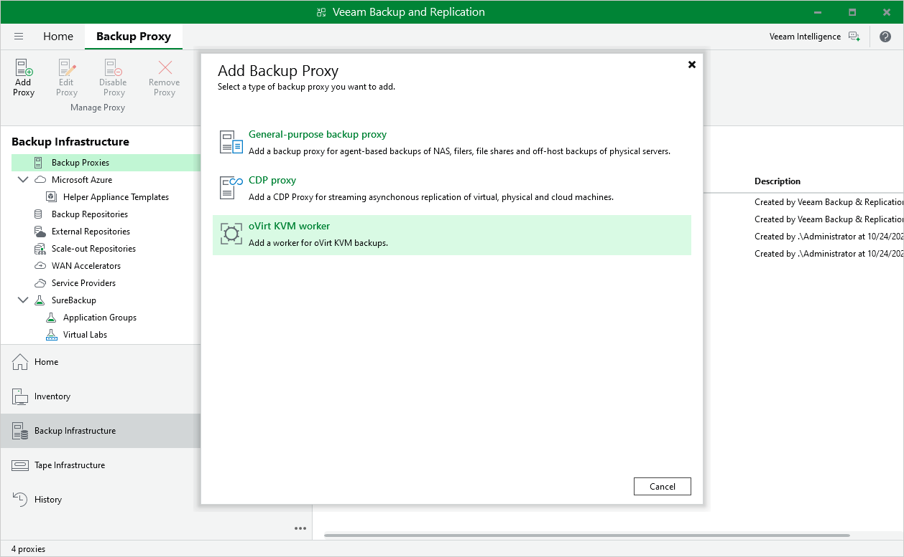

# Step 1. Launch New oVirt KVM Worker

To launch the New oVirt KVM Worker wizard, do the following:

1. In the Veeam Backup & Replication console, open the Backup Infrastructure view.
2. In the inventory pane, select Backup Proxies.
3. On the ribbon, select Add Proxy.

Alternatively, right-click the working area and select Add proxy.

1. Choose the option to deploy a worker.

