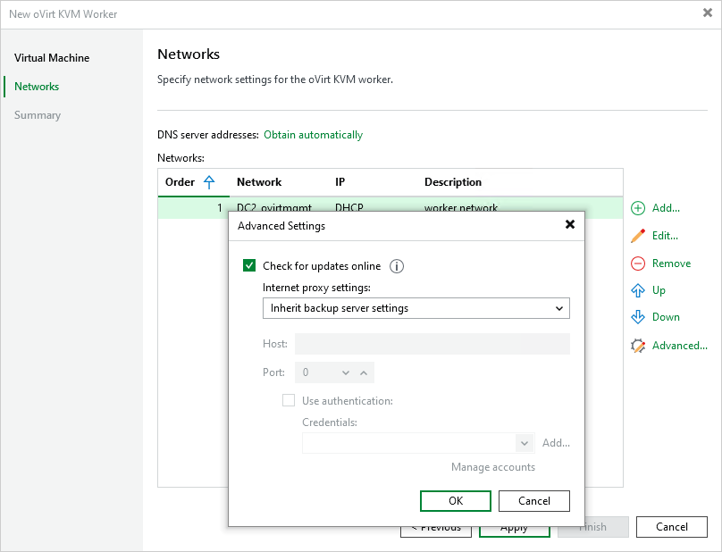

# Step 3. Configure Network Settings

At the Networks step of the wizard, do the following:

1. Click Add to configure worker network interfaces:

1. From the Network drop-down list, select a network to which the worker network interface will be connected.

For a network to be displayed in the list of the available networks, it must be configured in the virtual environment as described in [Red Hat Virtualization documentation](https://access.redhat.com/documentation/en-us/red_hat_virtualization/4.4/html/administration_guide/chap-logical_networks#Performing_Networking_Tasks) or [Oracle Linux Virtualization Manager documentation](https://docs.oracle.com/en/virtualization/oracle-linux-virtualization-manager/admin/admin-admin-networks.html).

1. In the Description field, provide a network interface description for future reference.
2. If DHCP is enabled for the selected network adapter, the IP address and DNS settings of the worker can be obtained automatically.

If DHCP is disabled for the selected network adapter, or you want to specify an IP address and configure DNS settings manually, select the Use the following IP address option and enter the worker IP address, subnet mask and default gateway.

To add more network interfaces, repeat the step and specify the network order using the Up and Down buttons. For more information on multi-network configuration, see [Appendix C. Configuring Multiple Networks](multiple_networks.md).

1. If DHCP is enabled in any network to which the worker will be connected, DNS settings of the worker can be obtained automatically. To configure DNS settings manually, click Obtain automatically and do the following in the DNS Server Settings window:

1. Select the Use the following DNS server address option.
2. Enter the IP addresses of the preferred and alternate DNS servers and click OK.

1. To check for available package updates for the worker, Veeam Backup & Replication automatically connects to Veeam repositories over the internet. If the worker is not connected to the internet, you can instruct Veeam Backup & Replication to use an HTTP proxy that will provide access to the necessary repositories. To specify HTTP proxy settings, click Advanced and do the following in the Advanced Settings window:

1. Select the Check for updates online check box.
2. Select the necessary proxy settings from the Internet proxy settings drop-down list.

By default, workers inherit the HTTP-proxy settings from the [Veeam Backup & Replication settings](https://helpcenter.veeam.com/docs/vbr/userguide/update_appliance_configure_updates.html?ver=13).

1. In the Host field, enter the IP address or FQDN of the web proxy.
2. In the Port field, enter the port used on the web proxy for HTTP or HTTPS connections.
3. [Applies only if the HTTP proxy requires authentication] Select the Use authentication check box and select credentials of the account configured on the HTTP proxy to access the internet.

|  |
| --- |
| Tip |
| If the worker does not have access to the internet and no HTTP proxy is configured for the worker, you can instruct Veeam Backup & Replication not to update it. To do that, clear the Check for updates online check box. |

