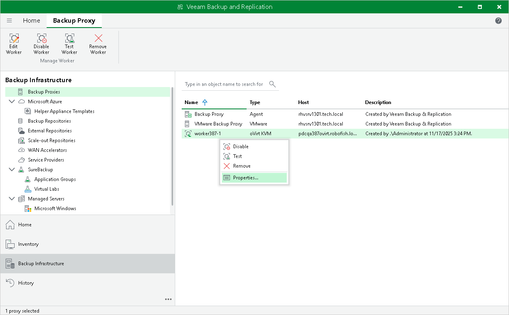

# Editing Workers

For each worker, you can modify settings specified while adding the worker to the backup infrastructure:

1. Open the Backup Infrastructure view.
2. In the inventory pane, select Backup Proxies.
3. In the working area, select the worker and click Edit Worker on the ribbon.

Alternatively, right-click the worker and select Properties.

1. Complete the Edit oVirt KVM Worker wizard:

1. To provide a new name and description for the worker, to change the storage domain where worker system files are stored, to specify a host where the worker is launched or to modify the number of tasks that the worker is able to handle in parallel, follow the instructions provided in section [Adding Workers](workers_add_vm.md) (step 2).
2. To change the network to which the worker is connected or to specify a new IP address for the worker, follow the instructions provided in section [Adding Workers](workers_add_vm.md) (step 3).
3. To save changes made to the worker settings, click Finish.

|  |
| --- |
| Important |
| It is not recommended that you change the worker storage domain, decrease the amount of allocated resources, adjust the affinity settings or modify the network settings while the worker is currently transferring data. In this case, Veeam Plug-in for OLVM and RHV will terminate the related operations, power off the worker and update the settings immediately. |

