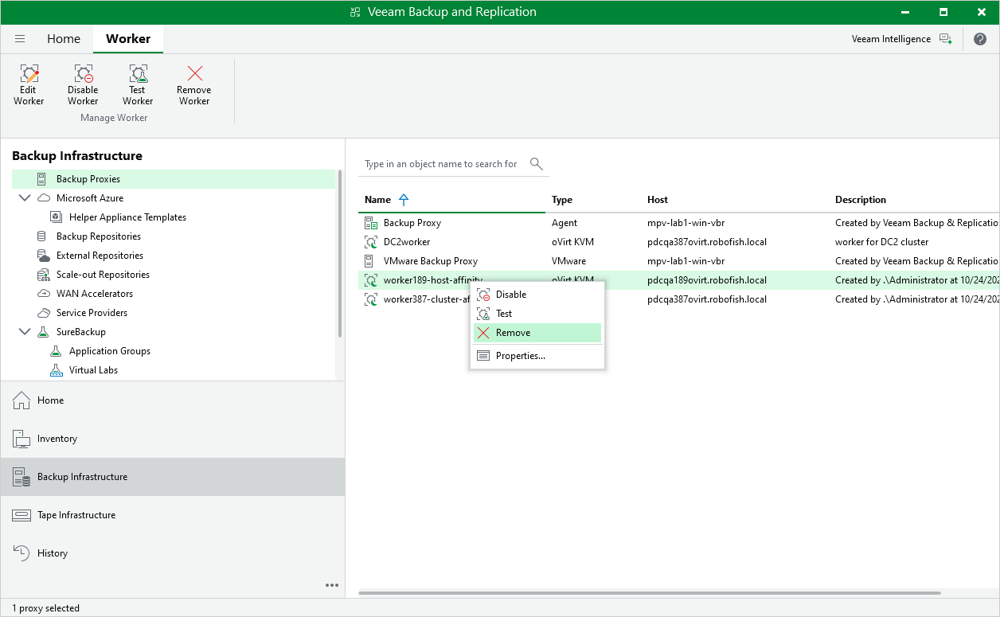

# Removing Workers

Veeam Plug-in for OLVM and RHV allows you to permanently remove workers if you no longer need them. Note that you can remove a worker only when it is not processing a backup or restore operation.

To remove a worker, do the following:

1. Open the Backup Infrastructure view.
2. In the inventory pane, select Backup Proxies.
3. In the working area, select the worker and click Remove Worker on the ribbon.

Alternatively, right-click the worker and select Remove.

1. In the Veeam Backup & Replication window, confirm that you want to permanently delete the worker.

